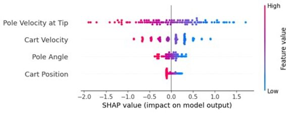

# SHAP Interpretability for a PPO CartPole Agent

A reinforcement learning explainability project that applies SHAP to analyze decision-making in a PPO agent trained on CartPole-v1.

This project trains a PPO agent using RLlib, extracts PyTorch policy logits, and applies SHAP DeepExplainer to visualize how state features (cart position, velocity, pole angle, angular velocity) influence action selection.


*SHAP summary plot showing feature impact on action selection*

## Key Components
- **Training:** PPO agent implemented using RLlib on CartPole-v1  
- **Interpretability:** SHAP DeepExplainer applied to the PyTorch policy network  
- **Logit Extraction:** Custom wrapper to enable SHAP compatibility with RLlib policies  
- **Visualization:** Action-specific SHAP summary plots for feature importance analysis

## Why This Is Important

Understanding reinforcement learning policies is challenging due to their black-box nature.  
This project demonstrates how model explainability techniques like SHAP can be adapted for RL to provide insight into decision-making behavior.

This approach is useful for debugging, validating, and improving RL models in real-world systems.

## Project Structure
- `cartpole_ppo.py` — trains and saves the PPO agent  
- `interpret_cp.py` — runs SHAP analysis and saves visualizations  
- `requirements.txt` — dependencies  
- `images/` — SHAP summary plots  

## How to Run

```bash
# (Optional) Create and activate a virtual environment
python -m venv venv
source venv/bin/activate      # macOS/Linux
# venv\Scripts\activate       # Windows

# Install dependencies
pip install -r requirements.txt

# 1) Train the PPO agent (saves policy checkpoints or weights)
python cartpole_ppo.py

# 2) Run SHAP interpretation (saves plots to ./images)
python interpret_cp.py
